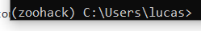

# ZooHackathon Brasil - 2019

Repositório de códigos para o zoohactkathon 2019.

# Como submeter

O passo a passo descrito aqui será utilizado para mantermos a boa prática na gestão do desenvolvimento da solução.

- 1º passo) Instale o Anaconda (python 3.7) e o "gitbash"
- 2º passo) Crie um "conda enviroment" utilizando o seguinte código no terminal do Anaconda (anaconda prompt):
```
conda create --name zoohack
```
Ele pedirá para digitar "y" ou "n", digite "y" é aperte enter. Esse código criará um ambiente com o nome "zoohack"

- 3º passo) Ative o ambiente com o comando: 
```
 conda activate zoohack
```

A partir desse código sua linha do terminal deverá constar o seguinte prefixo:



